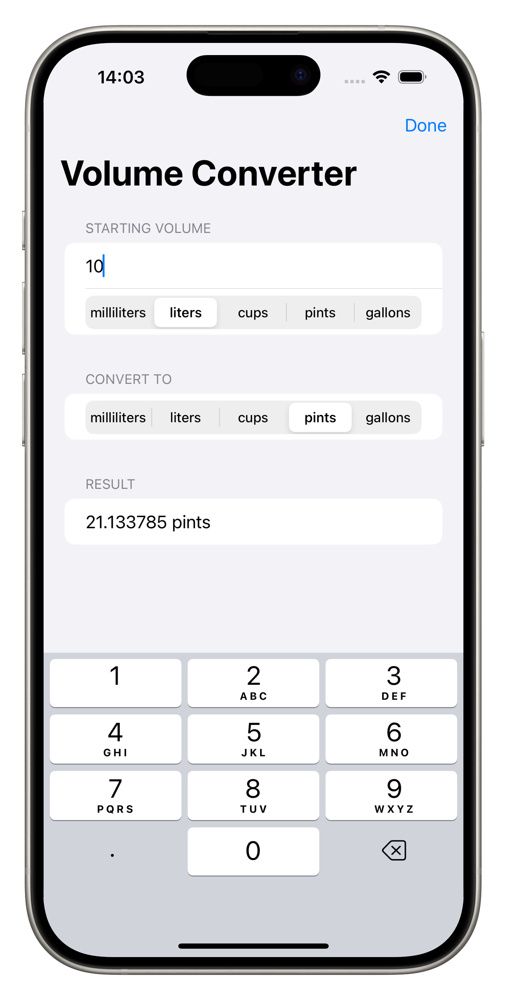

# Volume Converter

A unit conversion app built during Day 19 of the 100 Days of SwiftUI challenge - my first complete app built from scratch!

## Features

* Convert between 5 volume units: milliliters, liters, cups, pints, and gallons
* Real-time conversion calculations as you type
* Segmented controls for quick unit selection
* Clean, organized interface with separate sections
* Keyboard management with Done button

## Personal Enhancements

Beyond the basic challenge requirements, I added:

* **Segmented controls**: Replaced default pickers for faster unit switching
* **Organized sections**: Separate sections for "Starting Volume", "Convert To", and "Result" 
* **Focus state management**: Added @FocusState with toolbar Done button for smooth keyboard handling
* **Optional handling**: Used `Double?` with nil-coalescing operators for robust calculations
* **Better labeling**: Clear section headers and intuitive flow

## Technical Implementation

**Built with:**
* SwiftUI
* @State for reactive data management
* @FocusState for keyboard control
* Dictionary-based conversion factors
* Computed properties for real-time calculations
* Two-step conversion logic (input → milliliters → output)

**Key SwiftUI Concepts:**
* Building complete apps from scratch
* Dictionary lookups with force unwrapping
* Optional handling with nil-coalescing (`??`)
* Segmented picker styling
* Toolbar conditional display
* Form organization with sections

## Conversion Logic

The app uses a two-step conversion approach:
1. Convert input value to milliliters (base unit)
2. Convert milliliters to target unit

This eliminates the need for direct conversions between every unit pair, making the logic simpler and more maintainable.

## Screenshots

## What I Learned

* How to build a complete app from requirements
* Dictionary-based data modeling for conversions
* The power of computed properties for reactive UX
* Focus state management for better mobile UX
* When to use optionals in UI contexts
* Applying previous concepts (segmented controls, focus state) to new projects

**This was my first challenge project - building something completely from scratch using only the concepts learned so far!**

---
*Part of my 100 Days of SwiftUI journey!*
