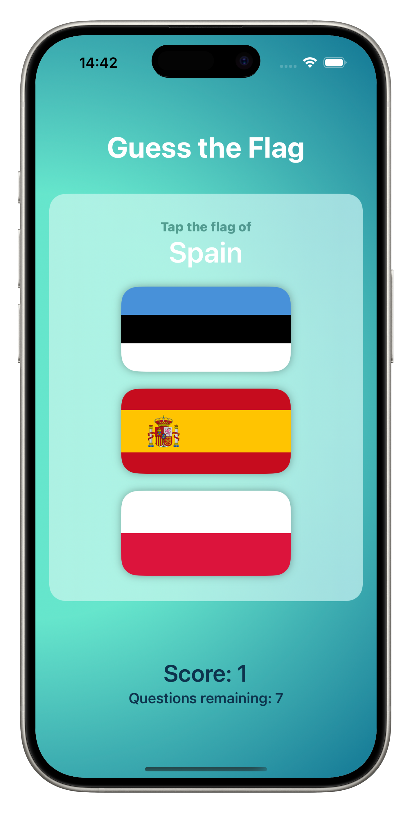

# Guess the Flag
A flag identification quiz game built during Days 20-22 of the 100 Days of SwiftUI challenge.

## Features
- **8-question game format** with progress tracking
- **Score system**: +1 for correct answers, -1 for incorrect
- **11 country flags**: Estonia, France, Germany, Ireland, Italy, Nigeria, Poland, Spain, UK, Ukraine, US
- **Dynamic flag randomization** for each question
- **Dual alert system**: Regular score alerts for questions 1-7, final game over alert for question 8
- **Game restart functionality** with score reset
- **Visual progress indicators** showing current score and questions remaining

## Personal Enhancements
Beyond the original tutorial, I implemented:
- **Custom gradient background**: Mint-to-teal radial gradient with `.leading` center point
- **Enhanced typography**: Strategic use of font weights (`.semibold`, `.weight(.heavy)`)
- **Color hierarchy design**: 
  - White for primary content (title, country name)
  - Teal for secondary info (score, questions remaining)
  - `.secondary` for instructional text
- **Improved spacing**: Increased padding and spacing for better visual breathing room
- **Negative scoring**: Users lose points for incorrect answers, adding challenge

## Technical Details
**Built with:**
- SwiftUI
- Multiple @State variables for game management
- Dual alert system with separate boolean controls
- Array shuffling for randomization
- Conditional logic for game flow
- RadialGradient with custom color stops

**Key SwiftUI Concepts:**
- **Stacks**: VStack and ZStack for layout organization
- **Buttons**: Button styling with custom labels and actions
- **Images**: Working with flag images from asset catalog
- **Alerts**: Multiple alert types with different presentations
- **Asset catalogs**: Managing and displaying image resources
- **Custom styling**: Moving beyond standard iOS look and feel
- **State management**: Coordinating multiple @State variables
- **Gradients**: RadialGradient for custom backgrounds

**Game Flow:**
1. User sees randomized flag selection
2. Taps flag → score updates → alert shows
3. Continues for 8 questions total
4. Final question triggers game over alert with restart option

## Code Architecture
- **`flagTapped()`**: Handles scoring, question counting, and alert triggering
- **`askQuestion()`**: Shuffles countries and selects new correct answer
- **`resetGame()`**: Resets all game state for fresh start
- **Dual alert management**: Separate `@State` booleans prevent alert conflicts

- ## Screenshots

## What I Learned
- **Layout fundamentals**: Using VStack and ZStack to organize UI elements
- **Interactive elements**: Creating buttons with custom styling and actions
- **Image management**: Working with asset catalogs and displaying images
- **Alert systems**: Implementing multiple alert types with proper state management
- **Custom design**: Moving beyond standard iOS styling with gradients and custom colors
- **Game state logic**: Managing score, question count, and game flow
- **SwiftUI architecture**: How to structure a complete interactive application

---
Part of my [100 Days of SwiftUI](../README.md) journey!
