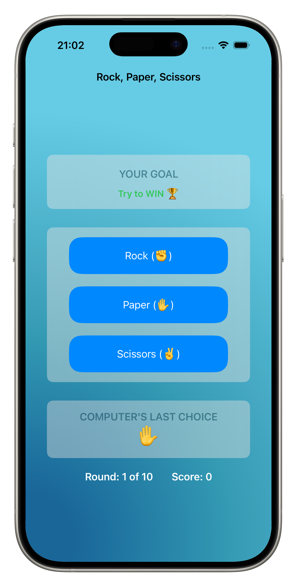

# Rock Paper Scissors
A brain training game built during Day 25 of the 100 Days of SwiftUI challenge.

## Features
- **10-round brain training game** with alternating win/lose objectives
- **Reverse psychology gameplay**: Sometimes you need to deliberately lose
- **Dynamic scoring system**: +1 for following instructions correctly, -1 for incorrect choices
- **Real-time feedback**: Shows whether your last move was correct or wrong
- **Complete game flow**: Progress tracking, final scoring, and restart functionality
- **Strategic thinking required**: Must choose winning OR losing moves based on instructions

## Personal Enhancements
Beyond the original tutorial requirements, I implemented:
- **Custom ocean gradient background**: Multi-stop radial gradient with twinkling ocean vibes
- **Card-based UI design**: Clean, organized layout with glassmorphism effects
- **NavigationStack implementation**: Proper iOS navigation title
- **Move validation feedback**: Real-time display of whether moves were correct
- **Code optimization**: Used ForEach to eliminate repetitive button code
- **Enhanced typography**: Strategic font weights and color hierarchy
- **Improved user flow**: Clear visual separation between game sections

## How It Works
The twist: This isn't regular Rock Paper Scissors!

**Game Logic:**
1. Computer randomly chooses Rock, Paper, or Scissors
2. Computer gives you an objective: "Try to WIN" or "Try to LOSE"
3. You must choose your move to achieve that objective
4. Score updates based on whether you followed the instruction

**Examples:**
- Computer shows Rock + "Try to WIN" → Choose Paper (Paper beats Rock) ✅
- Computer shows Rock + "Try to LOSE" → Choose Scissors (Rock beats Scissors) ✅
- Computer shows Rock + "Try to WIN" → Choose Scissors (Rock beats Scissors) ❌

## Technical Details
**Built with:**
- SwiftUI with NavigationStack
- Multiple @State variables for game management
- Custom RadialGradient background
- Alert system for game over functionality
- ForEach for clean, reusable button code

**Key SwiftUI Concepts:**
- **Navigation**: NavigationStack and navigationTitle modifiers
- **State Management**: Coordinating multiple @State variables
- **Conditional Logic**: Complex game rules and feedback systems
- **Custom Styling**: RadialGradient backgrounds and card-based layouts
- **Code Organization**: DRY principles with ForEach implementation
- **Alert Systems**: Game over alerts with restart functionality
- **Layout**: VStack organization with strategic spacing

**Game Architecture:**
- **`playerTapped()`**: Handles move validation, scoring, and round progression
- **`checkIfPlayerWon()`**: Determines traditional rock-paper-scissors winner
- **`resetGame()`**: Resets all game state for fresh start
- **Dual objectives**: Win/lose instructions alternate each round using `toggle()`

## Code Highlights
**Simplified Scoring Logic:**
```swift
let isCorrect = (winOrLose && playerWon) || (!winOrLose && !playerWon)
playerScore += isCorrect ? 1 : -1
lastMoveCorrect = isCorrect
```

**DRY Button Implementation:**
```swift
ForEach(0..<3, id: \.self) { index in
    Button {
        playerTapped(index)
    } label: {
        Text("\(["Rock", "Paper", "Scissors"][index]) (\(possibleMoves[index]))")
    }
    // ... styling
}
```

## What I Learned
- **NavigationStack**: Modern navigation implementation in SwiftUI
- **Complex Game Logic**: Managing dual win conditions and reverse psychology
- **Code Optimization**: Using ForEach to reduce repetitive code
- **Advanced State Management**: Coordinating multiple game state variables
- **Custom Gradients**: Creating visually appealing backgrounds
- **User Feedback Systems**: Real-time validation and feedback
- **Alert Management**: Proper game over flow with restart functionality
- **Strategic UI Design**: Card-based layouts with visual hierarchy

## Challenge Requirements Met
✅ App randomly picks rock, paper, or scissors each turn  
✅ App alternates between prompting player to win or lose  
✅ Player must tap correct move to win or lose the game  
✅ Correct choice = +1 point, incorrect choice = -1 point  
✅ Game ends after 10 questions  
✅ Final score displayed with restart option  
✅ Uses @State properties and proper SwiftUI architecture  

## Screenshots


---
Part of my [100 Days of SwiftUI](../README.md) journey!
